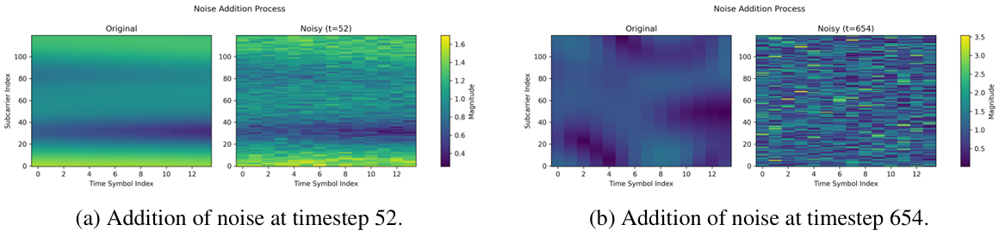
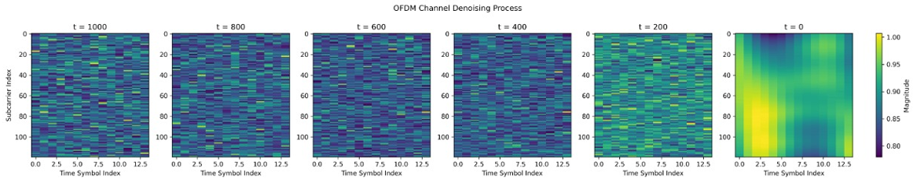
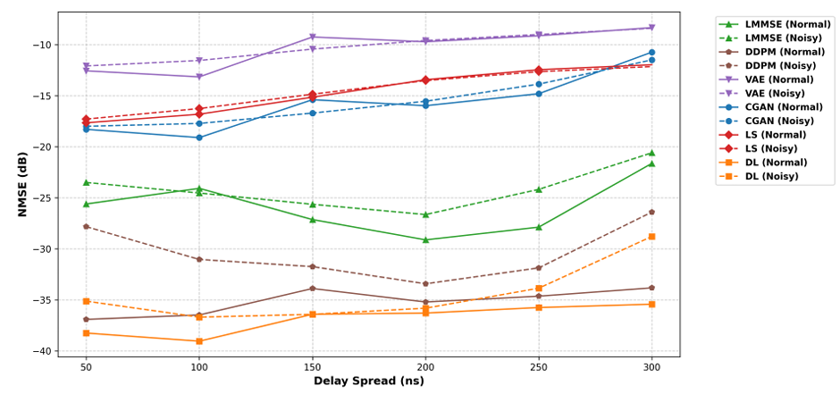

# Generative OFDM Channel Estimation using Conditional DDPM

This repository contains a complete implementation of a **Conditional Denoising Diffusion Probabilistic Model (DDPM)** for wireless **channel estimation** in **Orthogonal Frequency Division Multiplexing (OFDM)** systems. This approach reconstrutcs full channel matrices from sparse pilot signals and outperforms GAN, VAE, and classical estimators in accuracy and robustness.
## 🔍 Project Context
This repository is part of a larger research project exploring generative models for OFDM channel estimation. The full project compared three generative approahces:
- **DDPM** (this repo) - implemented by *Soyeon Kwon*
- **VAE** - implemented by *Neal Sharma*
- **cGAN** - implemented by *Berkay Guler*

This repo contains only the DDPM implementation and related scripts, which were collaboratively with *Berkay Guler* (pipeline support).

---
## 📌 Overview

Traditional OFDM channel estimation methods often lack robustness under varying noise, delay spread, and Doppler conditions. This project proposes a **generative modeling approach** using DDPMs, which model the full conditional distribution of channel states, enabling uncertainty-aware, high-fidelity reconstruction from sparse pilots.

- **Input**: LS-estimated sparse pilot matrix (18x2)
- **Output**: Full channel matrix (120x40)

---

## 🧰 Tools & Technologies

**Libraries Used**
- Python
- PyTorch
- NumPy
- SciPy
- Matplotlib

**Technologies Applied**
- Deep learning
- Generative modeling
- Conditional diffusion model (DDPM)

---

## 🔑 Key Features 
- ✨ **Conditional U-Net with Cross-Attention**
pilot symbols are processed through a dedicated encoder and used as conditioning inputs at every scale of the U-Net via cross-attention.
- 📈 **Superior Performance Within Generative Models**
achieved NMSE performance of **-37 db to -27 db**, outperforming GANs, VAEs, and LS/LMSE baselines.
- 🔄 **Denoising Process**
trained on a cosine-based noise schedule with 1000 timesteps and reverse sampling from pure noise guided by pilot conditions.

<p align="center">
<br/>
<em>Addition of Gaussian noise at intermediate timesteps.<br/>
<br/>
<em>Learning patterns by denoising one timestep each.
</p>

- 🧪 **Evaluation Tools**
include scripts for test set evaluation, NMSE computation, and qualitative result visualization.

---

## 📂 Repository structure ##
```
├── ddpm.py # Conditional DDPM model + training pipeline
├── ddpm_test.py # Testing and evaluation scripts (NMSE, plots)
├── dataloader.py # .mat dataset loader with multiple input modes
├── utils.py # Visualization, channel preprocessing, metrics
├── scripts/
│ ├── train.sh # Training script (edit for data path/checkpoint)
│ └── test.sh # Evaluation script (edit for test data paths)
├── doc/
│ ├── ddpm_report.pdf # Full project pdf 
│ ├── adding_Gnoise_forward.png # Forward process illustration
│ ├── denoising_reeverse.png # Reverse process illustration
│ └── performance_comparison.png # Performance comparison chart
└── README.md
```
---

## 📄 Project Report 
📘 Download the full project [report (PDF).](./doc/ddpm_report.pdf)

---

## 📊 Results ##

| **Methods** | **NMSE (dB)** |
|:------------|:--------------|
|**DDPM**|-37 to -27|
|cGAN|-18 to -10|
|VAE|-12 to -8|

> **NMSE (Normalized MeanSquared Error)** is a common metric in channel estimation that measures reconstruction error relative to the true signal power (ground truth) - lower (more negative) values indicate better performance. 

<p align="center">
<br/>
<em>Performance comparison with different models.
</p>
